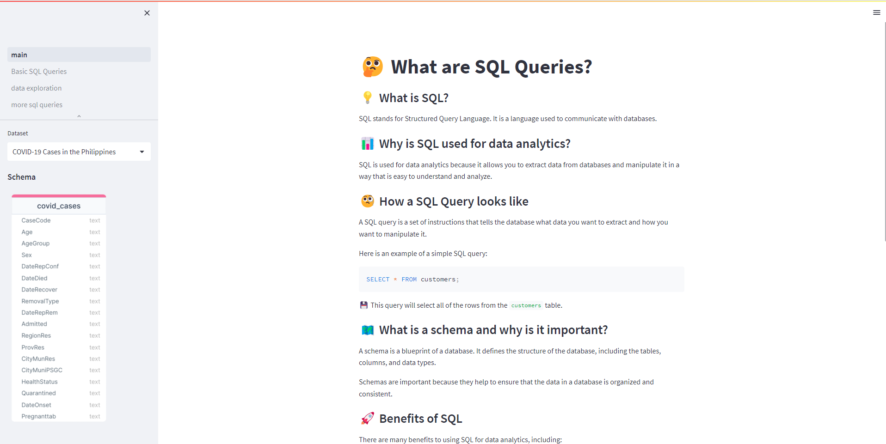

# Hands-on SQL Tutorial Using Streamlit
An interactive SQL demonstration by using sqlite3 in streamlit.

## Preview 

## Dataset Sources
[COVID-19 Cases in the Philippines](https://www.kaggle.com/datasets/cvronao/covid19-philippine-dataset?select=Case_Information.csv)

[Dengue Cases in the Philippines](https://www.kaggle.com/datasets/grosvenpaul/dengue-cases-in-the-philippines)

[Active Volcanoes in the Philippines](https://www.kaggle.com/datasets/gabbygab/active-volcanoes-in-the-philippines)

